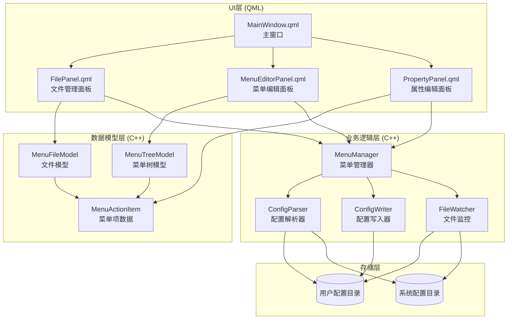

# DFM 右键菜单管理器 - 项目架构设计

## 项目概述

**项目名称**: dfm-menu-manager  
**技术栈**: QML + C++ Qt6  
**目标**: 创建一个可视化的dfm文件管理器右键菜单配置管理工具

## 核心功能需求

### 1. 配置文件管理
- 支持用户级配置目录: `~/.local/share/deepin/dde-file-manager/context-menus`
- 支持系统级配置目录: `/usr/share/applications/context-menus/`
- 配置文件格式: `.conf` (INI格式)
- 操作: 新建、修改、删除、重命名配置文件

### 2. 菜单结构
- 最多支持3级菜单嵌套
- 支持国际化 (中文/英文)
- 支持多种菜单类型和文件过滤

### 3. UI布局
- 三列布局，可调整宽度
- 窗口状态保存(位置、大小、列宽)
- 快捷键和右键菜单操作

---

## 技术架构设计

### 架构层次图



---

## 目录结构设计

```
dfm-menu-manager/
├── CMakeLists.txt                 # CMake构建配置
├── README.md                       # 项目说明
├── src/
│   ├── main.cpp                    # 程序入口
│   ├── core/                       # 核心业务逻辑
│   │   ├── menu_manager.h/cpp      # 菜单管理器
│   │   ├── config_parser.h/cpp     # 配置文件解析器
│   │   ├── config_writer.h/cpp     # 配置文件写入器
│   │   ├── file_watcher.h/cpp      # 文件变化监控
│   │   └── menu_types.h            # 数据类型定义
│   ├── models/                     # 数据模型
│   │   ├── menu_tree_model.h/cpp   # 菜单树形模型
│   │   ├── menu_file_model.h/cpp   # 文件列表模型
│   │   └── menu_action_item.h/cpp  # 菜单项数据结构
│   ├── utils/                      # 工具类
│   │   ├── config_helper.h/cpp     # 配置辅助工具
│   │   ├── file_utils.h/cpp        # 文件操作工具
│   │   └── icon_provider.h/cpp     # 图标提供器
│   └── resources/                  # 资源文件
│       ├── icons/                  # 图标资源
│       └── qml.qrc                 # QML资源文件
├── qml/                            # QML界面文件
│   ├── main.qml                    # 主窗口
│   ├── components/                 # 可复用组件
│   │   ├── FilePanel.qml           # 文件管理面板
│   │   ├── MenuEditorPanel.qml     # 菜单编辑面板
│   │   ├── PropertyPanel.qml       # 属性编辑面板
│   │   ├── SearchBox.qml           # 搜索框组件
│   │   ├── CollapsibleGroupBox.qml # 可折叠分组框
│   │   ├── MenuTreeView.qml        # 菜单树视图
│   │   ├── ActionSelector.qml      # 动作选择器
│   │   ├── SuffixSelector.qml      # 后缀选择器
│   │   ├── ExecCommandEditor.qml   # 命令编辑器
│   │   └── ContextMenu.qml         # 右键菜单
│   └── styles/                     # 样式文件
│       ├── Style.qml               # 全局样式
│       └── ButtonStyle.qml         # 按钮样式
├── tests/                          # 单元测试
│   ├── test_config_parser.cpp      # 配置解析测试
│   ├── test_config_writer.cpp      # 配置写入测试
│   └── test_menu_manager.cpp       # 菜单管理测试
└── docs/                           # 文档
    ├── architecture.md             # 架构文档
    ├── api.md                      # API文档
    └── user_guide.md               # 用户指南
```

---

## 数据模型设计

### 1. MenuActionItem (菜单项数据结构)

```cpp
class MenuActionItem {
public:
    // 基本信息
    QString id;                      // 唯一标识符
    QString name;                    // 菜单名称
    QString nameLocal;               // 本地化名称
    QString comment;                 // 描述
    QString commentLocal;            // 本地化描述
    
    // 菜单配置
    QStringList menuTypes;           // 菜单类型列表
    QStringList supportSuffix;       // 支持的文件后缀
    int positionNumber;              // 位置编号
    QMap<QString, int> positionByType; // 按类型的位置
    bool separatorTop;               // 顶部分隔符
    bool separatorBottom;            // 底部分隔符
    
    // 动作配置
    QString execCommand;             // 执行命令
    QStringList childActions;        // 子菜单ID列表
    
    // 元数据
    bool isRoot;                     // 是否为根菜单项
    int level;                       // 菜单层级 (1-3)
    QString configFile;              // 所属配置文件
    bool isSystem;                   // 是否为系统配置
};
```

### 2. MenuTreeModel (菜单树形模型)

```cpp
class MenuTreeModel : public QAbstractItemModel {
    Q_OBJECT
    
public:
    // 角色枚举
    enum Roles {
        NameRole = Qt::UserRole + 1,
        NameLocalRole,
        IdRole,
        LevelRole,
        HasChildrenRole,
        IsEditableRole,
        IsSystemRole
    };
    
    // 核心方法
    QModelIndex index(int row, int column, 
                     const QModelIndex &parent = QModelIndex()) const override;
    QModelIndex parent(const QModelIndex &child) const override;
    int rowCount(const QModelIndex &parent = QModelIndex()) const override;
    int columnCount(const QModelIndex &parent = QModelIndex()) const override;
    QVariant data(const QModelIndex &index, int role = Qt::DisplayRole) const override;
    
    // 菜单操作
    Q_INVOKABLE void addItem(const QModelIndex &parent, const QString &name);
    Q_INVOKABLE void removeItem(const QModelIndex &index);
    Q_INVOKABLE void moveItem(const QModelIndex &index, int direction);
    Q_INVOKABLE void updateItem(const QModelIndex &index, const QString &role, 
                               const QVariant &value);
};
```

### 3. MenuFileModel (文件列表模型)

```cpp
class MenuFileModel : public QAbstractListModel {
    Q_OBJECT
    
public:
    enum Roles {
        FileNameRole = Qt::UserRole + 1,
        FilePathRole,
        IsSystemRole,
        IsModifiedRole,
        CommentRole
    };
    
    // 核心方法
    int rowCount(const QModelIndex &parent = QModelIndex()) const override;
    QVariant data(const QModelIndex &index, int role = Qt::DisplayRole) const override;
    
    // 文件操作
    Q_INVOKABLE void refresh();
    Q_INVOKABLE void createFile(const QString &name);
    Q_INVOKABLE void deleteFile(const QString &path);
    Q_INVOKABLE void renameFile(const QString &path, const QString &newName);
    Q_INVOKABLE QString copyFile(const QString &sourcePath, bool toSystem = false);
};
```

---

## 核心类设计

### 1. MenuManager (菜单管理器)

```cpp
class MenuManager : public QObject {
    Q_OBJECT
    
public:
    explicit MenuManager(QObject *parent = nullptr);
    
    // 配置文件管理
    Q_INVOKABLE void loadConfigurations();
    Q_INVOKABLE bool saveConfiguration(const QString &filePath);
    Q_INVOKABLE bool createNewConfig(const QString &name, bool isSystem = false);
    Q_INVOKABLE bool deleteConfig(const QString &filePath);
    
    // 菜单操作
    Q_INVOKABLE MenuTreeModel* getMenuModel(const QString &configFile);
    Q_INVOKABLE void setCurrentConfig(const QString &configFile);
    Q_INVOKABLE QString getCurrentConfig() const;
    
    // 验证
    Q_INVOKABLE bool validateConfig(const QString &filePath);
    Q_INVOKABLE QStringList getValidationErrors();
    
signals:
    void configLoaded(const QString &configFile);
    void configSaved(const QString &configFile);
    void configChanged(const QString &configFile);
    void errorOccurred(const QString &message);
    
private:
    ConfigParser *m_parser;
    ConfigWriter *m_writer;
    FileWatcher *m_watcher;
    QMap<QString, MenuTreeModel*> m_models;
    QString m_currentConfig;
};
```

### 2. ConfigParser (配置解析器)

```cpp
class ConfigParser {
public:
    struct ConfigData {
        QString version;
        QString comment;
        QString commentLocal;
        QList<MenuActionItem> actions;
        QString rootActionId;
    };
    
    // 解析方法
    static ConfigData parseFile(const QString &filePath);
    static bool parseLine(const QString &line, QString &key, QString &value);
    static QStringList parseActions(const QString &actionsStr);
    static QStringList parseList(const QString &listStr, const QString &separator);
    
    // 验证方法
    static bool validate(const ConfigData &data);
    static QString getValidationError(const ConfigData &data);
};
```

### 3. ConfigWriter (配置写入器)

```cpp
class ConfigWriter {
public:
    // 写入方法
    static bool writeToFile(const QString &filePath, 
                           const ConfigParser::ConfigData &data);
    static bool backupFile(const QString &filePath);
    
    // 格式化方法
    static QString formatEntry(const MenuActionItem &item);
    static QString formatComment(const QString &text);
    static QString formatList(const QStringList &list, 
                             const QString &separator);
};
```

---

## UI组件设计

### 主窗口布局 (main.qml)

```qml
ApplicationWindow {
    id: root
    
    // 窗口属性
    width: 1400
    height: 900
    minimumWidth: 1000
    minimumHeight: 600
    
    // 三列布局
    Row {
        anchors.fill: parent
        spacing: 0
        
        // 左侧: 文件管理区 (25%)
        FilePanel {
            id: filePanel
            width: parent.width * 0.25
            height: parent.height
        }
        
        // 分隔器
        Rectangle {
            width: 1
            height: parent.height
            color: Style.borderColor
        }
        
        // 中间: 菜单编辑区 (45%)
        MenuEditorPanel {
            id: menuEditor
            width: parent.width * 0.45
            height: parent.height
        }
        
        // 分隔器
        Rectangle {
            width: 1
            height: parent.height
            color: Style.borderColor
        }
        
        // 右侧: 属性编辑区 (30%)
        PropertyPanel {
            id: propertyPanel
            width: parent.width * 0.30
            height: parent.height
        }
    }
}
```

### 文件管理面板 (FilePanel.qml)

```qml
Column {
    spacing: 0
    
    // 搜索框
    SearchBox {
        id: searchBox
        width: parent.width
        placeholder: qsTr("搜索配置文件...")
    }
    
    ScrollView {
        // 用户配置文件区
        CollapsibleGroupBox {
            id: userGroup
            title: qsTr("用户配置")
            isExpanded: true
            
            ListView {
                model: menuFileModel
                delegate: FileItemDelegate {}
            }
        }
        
        // 系统配置文件区
        CollapsibleGroupBox {
            id: systemGroup
            title: qsTr("系统配置")
            isExpanded: false
            
            ListView {
                model: systemFileModel
                delegate: FileItemDelegate {}
            }
        }
    }
}
```

### 菜单编辑面板 (MenuEditorPanel.qml)

```qml
Column {
    spacing: 0
    
    // 工具栏 (隐藏,使用快捷键)
    Rectangle {
        height: 40
        color: Style.toolbarColor
        
        Row {
            anchors.centerIn: parent
            spacing: 20
            
            Label {
                text: qsTr("菜单结构编辑")
                font: Style.titleFont
            }
        }
    }
    
    // 树形菜单编辑器
    ScrollView {
        MenuTreeView {
            id: menuTree
            model: currentMenuModel
            
            // 支持的操作
            supportDrop: true
            supportReorder: true
            
            // 右键菜单
            contextMenu: Menu {
                MenuItem {
                    text: qsTr("添加子菜单")
                    shortcut: "Ctrl+N"
                    onTriggered: menuTree.addChild()
                }
                MenuItem {
                    text: qsTr("删除")
                    shortcut: "Delete"
                    onTriggered: menuTree.removeCurrent()
                }
                MenuSeparator {}
                MenuItem {
                    text: qsTr("上移")
                    shortcut: "Ctrl+Up"
                    onTriggered: menuTree.moveUp()
                }
                MenuItem {
                    text: qsTr("下移")
                    shortcut: "Ctrl+Down"
                    onTriggered: menuTree.moveDown()
                }
            }
        }
    }
}
```

### 属性编辑面板 (PropertyPanel.qml)

```qml
ScrollView {
    Column {
        spacing: 15
        padding: 20
        
        // 菜单名称
        LabeledTextField {
            id: nameField
            label: qsTr("菜单名称")
            placeholder: qsTr("输入菜单名称")
        }
        
        LabeledTextField {
            id: nameLocalField
            label: qsTr("菜单名称(中文)")
            placeholder: qsTr("输入中文菜单名称")
        }
        
        // 可执行命令
        ExecCommandEditor {
            id: execEditor
            label: qsTr("可执行命令")
        }
        
        // 菜单显示类型
        ActionSelector {
            id: actionSelector
            label: qsTr("菜单显示类型")
            options: [
                "SingleFile", "MultiFiles", "Filemanager",
                "SingleDir", "BlankSpace"
            ]
        }
        
        // 文件后缀名
        SuffixSelector {
            id: suffixSelector
            label: qsTr("文件后缀名")
            commonSuffixes: [
                "mp4", "avi", "mkv", "jpg", "png", "pdf", "txt"
            ]
        }
        
        // 位置编号
        LabeledSpinBox {
            id: posNumField
            label: qsTr("位置编号")
            from: 1
            to: 999
        }
        
        // 分隔符选项
        CheckBoxGroup {
            id: separatorGroup
            label: qsTr("分隔符")
            options: [
                { text: qsTr("顶部"), value: "Top" },
                { text: qsTr("底部"), value: "Bottom" }
            ]
        }
    }
}
```

---

## 快捷键设计

| 快捷键 | 功能 |
|--------|------|
| `Ctrl+N` | 新建子菜单项 |
| `Ctrl+Shift+N` | 新建配置文件 |
| `Delete` | 删除选中项 |
| `Ctrl+S` | 保存当前配置 |
| `Ctrl+O` | 打开配置文件 |
| `Ctrl+F` | 聚焦搜索框 |
| `Ctrl+Up` | 上移菜单项 |
| `Ctrl+Down` | 下移菜单项 |
| `Ctrl+C` | 复制菜单项 |
| `Ctrl+V` | 粘贴菜单项 |
| `F2` | 重命名 |
| `Escape` | 取消当前操作 |
| `Ctrl+Q` | 退出应用 |

---

## 右键菜单设计

### 文件列表右键菜单
- 新建配置文件
- 打开
- 重命名
- 复制到系统/用户目录
- 删除
- 刷新

### 菜单树右键菜单
- 添加子菜单
- 添加兄弟菜单
- 删除
- 复制
- 粘贴
- 上移
- 下移
- 展开/折叠全部

---

## 窗口状态管理

```cpp
class WindowManager : public QObject {
    Q_OBJECT
    
public:
    static WindowManager* instance();
    
    void saveState(QQuickWindow *window);
    void restoreState(QQuickWindow *window);
    
private:
    QSettings m_settings;
    
    struct WindowState {
        QByteArray geometry;
        QByteArray state;
        QList<int> splitterSizes;
    };
};
```

---

## 构建配置 (CMakeLists.txt)

```cmake
cmake_minimum_required(VERSION 3.16)
project(dfm-menu-manager VERSION 1.0.0)

set(CMAKE_CXX_STANDARD 17)
set(CMAKE_CXX_STANDARD_REQUIRED ON)
set(CMAKE_AUTOMOC ON)
set(CMAKE_AUTORCC ON)

# Qt6 依赖
find_package(Qt6 REQUIRED COMPONENTS 
    Core Quick Qml Widgets 
)

# 源文件
set(SOURCES
    src/main.cpp
    src/core/menu_manager.cpp
    src/core/config_parser.cpp
    src/core/config_writer.cpp
    src/core/file_watcher.cpp
    src/models/menu_tree_model.cpp
    src/models/menu_file_model.cpp
    src/models/menu_action_item.cpp
    src/utils/config_helper.cpp
    src/utils/file_utils.cpp
)

# 头文件
set(HEADERS
    src/core/menu_manager.h
    src/core/config_parser.h
    src/core/config_writer.h
    src/core/file_watcher.h
    src/models/menu_tree_model.h
    src/models/menu_file_model.h
    src/models/menu_action_item.h
    src/utils/config_helper.h
    src/utils/file_utils.h
)

# 可执行文件
add_executable(${PROJECT_NAME}
    ${SOURCES}
    ${HEADERS}
    src/resources/qml.qrc
)

target_link_libraries(${PROJECT_NAME}
    Qt6::Core
    Qt6::Quick
    Qt6::Qml
    Qt6::Widgets
)

# 安装
install(TARGETS ${PROJECT_NAME} 
    DESTINATION /usr/bin
)
```

---

## 技术要点

### 1. 三列可调整布局实现
- 使用 `SplitView` (Qt 5.15+) 或自定义分隔器
- 保存列宽到配置文件
- 响应窗口大小变化

### 2. 树形菜单编辑
- 使用 `TreeView` 或自定义 `ListView`
- 支持拖拽重排序
- 支持最多3级嵌套

### 3. 配置文件解析
- 使用 `QSettings` 读写 INI 格式
- 处理国际化字段
- 验证配置完整性

### 4. 文件监控
- 使用 `QFileSystemWatcher`
- 实时更新文件列表
- 处理外部修改冲突

### 5. 权限管理
- 系统配置需要 root 权限
- 用户配置直接读写
- 提供权限提升提示

---

## 开发阶段规划

### Phase 1: 基础框架
- [x] 项目结构搭建
- [ ] CMake 配置
- [ ] 基础 C++ 类框架
- [ ] 基础 QML 界面框架

### Phase 2: 核心功能
- [ ] 配置文件解析器
- [ ] 配置文件写入器
- [ ] 数据模型实现
- [ ] 菜单管理器

### Phase 3: UI实现
- [ ] 三列布局
- [ ] 文件管理面板
- [ ] 菜单树编辑器
- [ ] 属性编辑面板

### Phase 4: 高级功能
- [ ] 快捷键系统
- [ ] 右键菜单
- [ ] 拖拽操作
- [ ] 窗口状态保存

### Phase 5: 测试与优化
- [ ] 单元测试
- [ ] 集成测试
- [ ] 性能优化
- [ ] 文档完善

---

## 依赖项

- Qt 6.2+
- CMake 3.16+
- C++17 编译器
- DTK (Deepin Tool Kit) - 可选,用于深度系统集成

---

## 注意事项

1. **权限处理**: 系统配置目录需要 root 权限,需要使用 polkit 或 pkexec
2. **配置备份**: 修改前自动备份配置文件
3. **错误处理**: 完善的错误提示和恢复机制
4. **国际化**: 支持中英文切换
5. **性能**: 大量配置文件时的加载性能优化
6. **兼容性**: 确保生成的配置文件与 dfm 兼容
