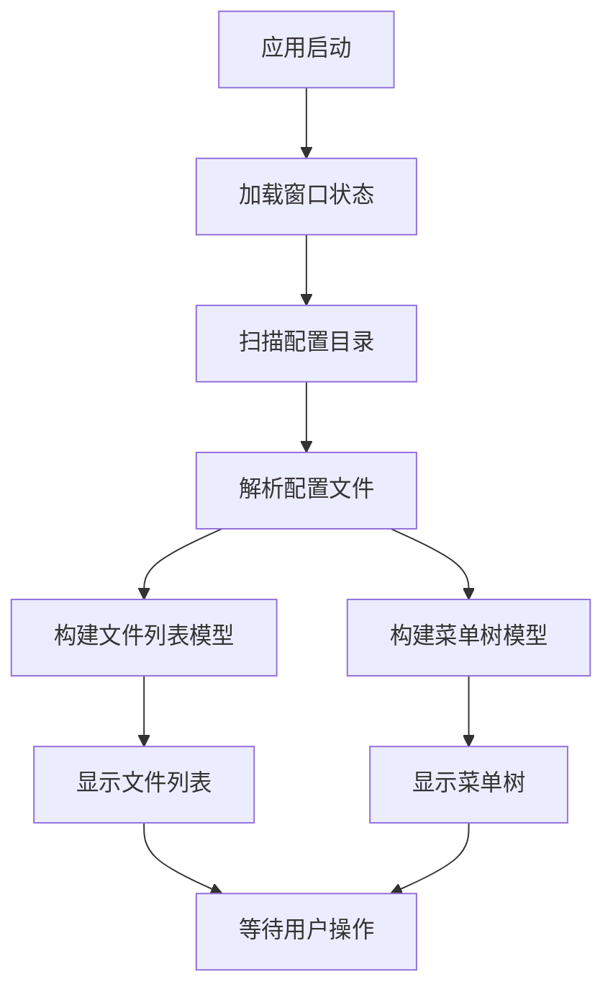
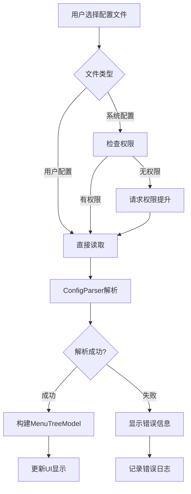
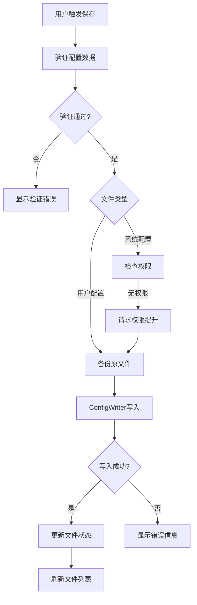
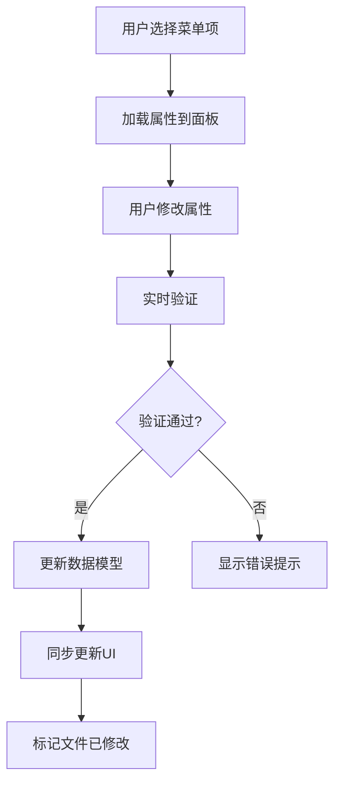
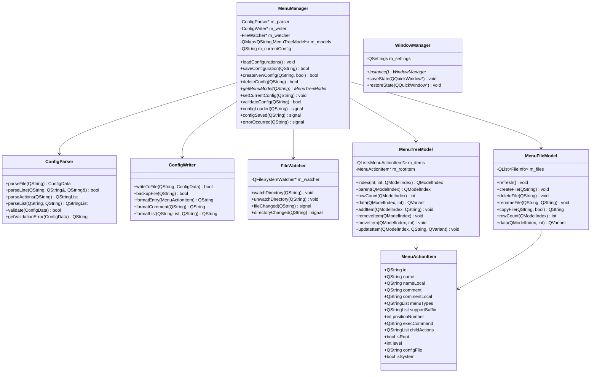
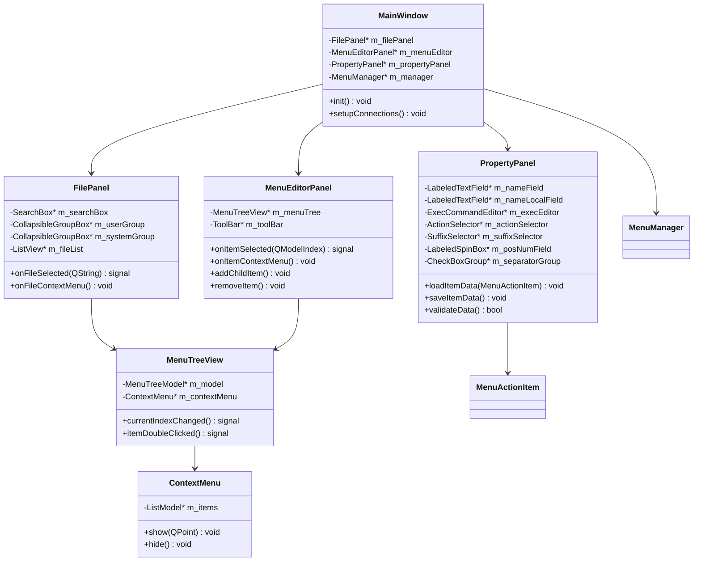
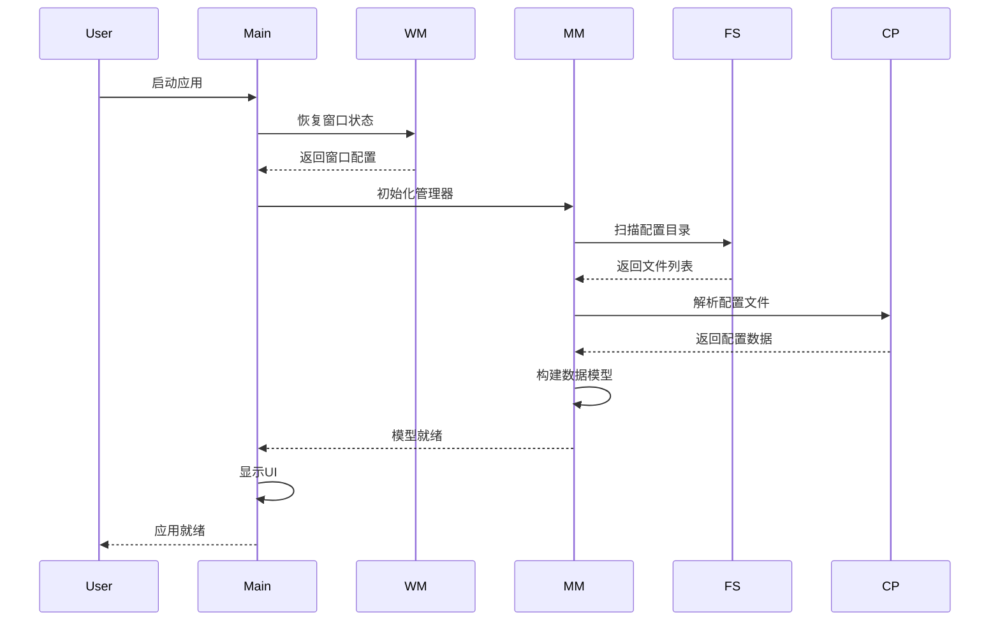
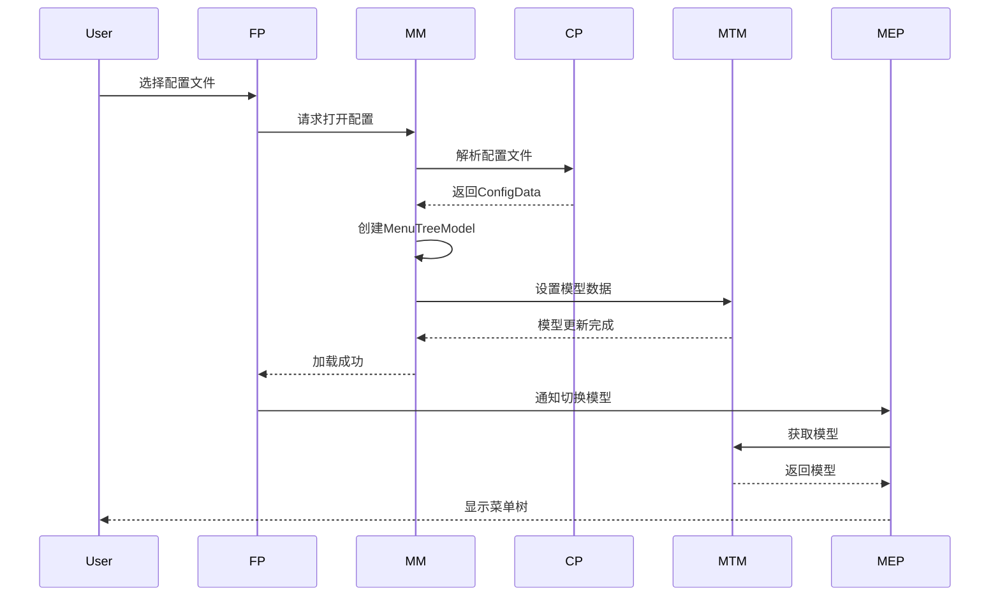
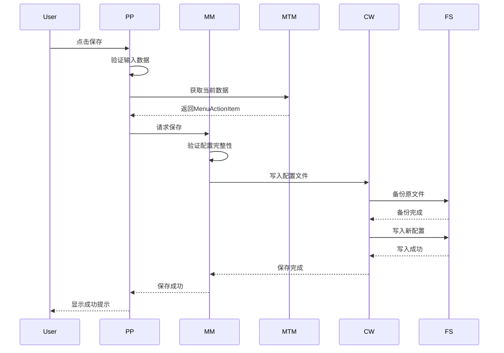
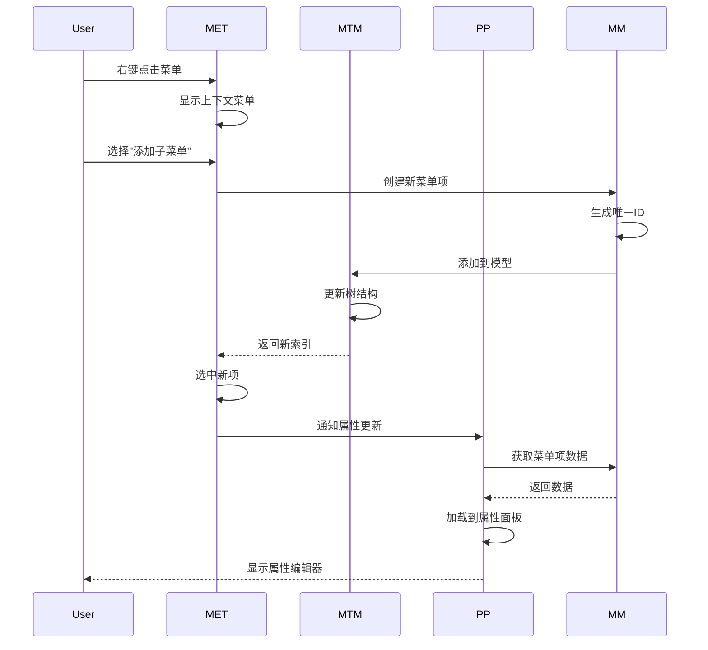

# DFM 右键菜单管理器 - 详细设计文档

## 1. 数据流图

### 1.1 应用启动流程



### 1.2 配置文件加载流程



### 1.3 配置文件保存流程



### 1.4 菜单项编辑流程



---

## 2. 类图设计

### 2.1 核心类关系图



### 2.2 UI组件类图



---

## 3. 时序图

### 3.1 应用启动时序



### 3.2 打开配置文件时序



### 3.3 保存配置文件时序



### 3.4 添加菜单项时序



---

## 4. 关键模块详细设计

### 4.1 配置文件解析器 (ConfigParser)

#### 4.1.1 数据结构

```cpp
struct ConfigData {
    QString version;                    // 版本号
    QString comment;                    // 描述
    QString commentLocal;               // 本地化描述
    QList<MenuActionItem> actions;      // 所有菜单项
    QString rootActionId;               // 根菜单ID
    QMap<QString, MenuActionItem*> actionMap;  // ID到项的映射
};

struct ActionReference {
    QString actionId;                   // 动作ID
    QString groupName;                  // 所属组名
    int position;                       // 位置
};
```

#### 4.1.2 解析算法

```cpp
class ConfigParser {
public:
    static ConfigData parseFile(const QString &filePath) {
        ConfigData data;
        QFile file(filePath);
        
        if (!file.open(QIODevice::ReadOnly | QIODevice::Text)) {
            return data;  // 返回空数据
        }
        
        MenuActionItem *currentAction = nullptr;
        QString currentGroup;
        
        while (!file.atEnd()) {
            QString line = QString::fromUtf8(file.readLine()).trimmed();
            
            // 跳过空行和注释
            if (line.isEmpty() || line.startsWith('#')) {
                continue;
            }
            
            // 解析组头 [Menu Action xxx]
            if (line.startsWith('[') && line.endsWith(']')) {
                currentGroup = line.mid(1, line.length() - 2);
                
                if (currentGroup.startsWith("Menu Action ")) {
                    QString actionId = currentGroup.mid(12);
                    currentAction = new MenuActionItem();
                    currentAction->id = actionId;
                    currentAction->isRoot = false;
                    data.actions.append(*currentAction);
                    data.actionMap[actionId] = currentAction;
                } else if (currentGroup == "Menu Entry") {
                    currentAction = new MenuActionItem();
                    currentAction->isRoot = true;
                    currentAction->id = "root";
                    data.rootActionId = "root";
                    data.actions.append(*currentAction);
                    data.actionMap["root"] = currentAction;
                }
                continue;
            }
            
            // 解析键值对
            QString key, value;
            if (parseLine(line, key, value)) {
                if (!currentAction) {
                    continue;
                }
                
                // 处理各种字段
                if (key == "Name") {
                    currentAction->name = value;
                } else if (key == "Name[zh_CN]") {
                    currentAction->nameLocal = value;
                } else if (key == "Comment") {
                    if (currentAction->isRoot) {
                        data.comment = value;
                    } else {
                        currentAction->comment = value;
                    }
                } else if (key == "Comment[zh_CN]") {
                    if (currentAction->isRoot) {
                        data.commentLocal = value;
                    } else {
                        currentAction->commentLocal = value;
                    }
                } else if (key == "Version") {
                    data.version = value;
                } else if (key == "Actions") {
                    currentAction->childActions = parseActions(value);
                } else if (key == "X-DFM-MenuTypes") {
                    currentAction->menuTypes = parseList(value, ":");
                } else if (key == "X-DFM-SupportSuffix") {
                    currentAction->supportSuffix = parseList(value, ":");
                } else if (key == "PosNum") {
                    currentAction->positionNumber = value.toInt();
                } else if (key == "Exec") {
                    currentAction->execCommand = value;
                } else if (key == "Separator") {
                    if (value == "Top") {
                        currentAction->separatorTop = true;
                    } else if (value == "Bottom") {
                        currentAction->separatorBottom = true;
                    }
                }
            }
        }
        
        // 构建树形结构
        buildTreeStructure(data);
        
        file.close();
        return data;
    }
    
private:
    static void buildTreeStructure(ConfigData &data) {
        // 为每个菜单项设置层级
        for (auto &action : data.actions) {
            calculateLevel(action, data);
        }
    }
    
    static void calculateLevel(MenuActionItem &action, ConfigData &data) {
        if (action.isRoot) {
            action.level = 0;
            return;
        }
        
        // 查找父级
        for (auto &parent : data.actions) {
            if (parent.childActions.contains(action.id)) {
                action.level = parent.level + 1;
                if (action.level > 3) {
                    action.level = 3;  // 最多3级
                }
                return;
            }
        }
        
        action.level = 1;  // 默认为一级
    }
};
```

### 4.2 配置文件写入器 (ConfigWriter)

#### 4.2.1 写入算法

```cpp
class ConfigWriter {
public:
    static bool writeToFile(const QString &filePath, 
                           const ConfigParser::ConfigData &data) {
        // 先备份
        if (!backupFile(filePath)) {
            return false;
        }
        
        QFile file(filePath);
        if (!file.open(QIODevice::WriteOnly | QIODevice::Text)) {
            return false;
        }
        
        QTextStream out(&file);
        out.setEncoding(QStringConverter::Utf8);
        
        // 写入 Menu Entry 组
        out << "[Menu Entry]\n\n";
        
        if (!data.comment.isEmpty()) {
            out << formatComment(data.comment) << "\n";
        }
        if (!data.commentLocal.isEmpty()) {
            out << formatComment(data.commentLocal) << "\n";
        }
        
        out << "Version=" << data.version << "\n\n";
        
        // 写入根菜单的 Actions
        auto rootItem = data.actionMap.value("root");
        if (rootItem && !rootItem->childActions.isEmpty()) {
            out << "Actions=" << rootItem->childActions.join(":") << "\n\n";
        }
        
        // 写入各个 Menu Action 组
        for (const auto &action : data.actions) {
            if (action.isRoot) {
                continue;  // 跳过根项
            }
            
            out << formatEntry(action) << "\n";
        }
        
        file.close();
        return true;
    }
    
    static QString formatEntry(const MenuActionItem &item) {
        QString result;
        QTextStream out(&result);
        
        out << "[Menu Action " << item.id << "]\n";
        
        // 基本信息
        out << "Name=" << item.name << "\n";
        if (!item.nameLocal.isEmpty()) {
            out << "Name[zh_CN]=" << item.nameLocal << "\n";
        }
        
        // 菜单类型
        if (!item.menuTypes.isEmpty()) {
            out << "X-DFM-MenuTypes=" << item.menuTypes.join(":") << "\n";
        }
        
        // 文件后缀
        if (!item.supportSuffix.isEmpty()) {
            out << "X-DFM-SupportSuffix=" << item.supportSuffix.join(":") << "\n";
        }
        
        // 位置
        out << "PosNum=" << item.positionNumber << "\n";
        
        // 分隔符
        if (item.separatorTop) {
            out << "Separator=Top\n";
        }
        if (item.separatorBottom) {
            out << "Separator=Bottom\n";
        }
        
        // 子菜单或执行命令
        if (!item.childActions.isEmpty()) {
            out << "Actions=" << item.childActions.join(":") << "\n";
        } else if (!item.execCommand.isEmpty()) {
            out << "Exec=" << item.execCommand << "\n";
        }
        
        return result;
    }
    
    static bool backupFile(const QString &filePath) {
        if (!QFile::exists(filePath)) {
            return true;  // 文件不存在,不需要备份
        }
        
        QString backupPath = filePath + ".bak";
        return QFile::copy(filePath, backupPath);
    }
};
```

### 4.3 菜单树模型 (MenuTreeModel)

#### 4.3.1 模型实现

```cpp
class MenuTreeModel : public QAbstractItemModel {
    Q_OBJECT
    
public:
    enum Roles {
        NameRole = Qt::UserRole + 1,
        NameLocalRole,
        IdRole,
        LevelRole,
        HasChildrenRole,
        IsEditableRole,
        IsSystemRole,
        ExecCommandRole,
        MenuTypesRole,
        SupportSuffixRole,
        PositionNumberRole
    };
    
    explicit MenuTreeModel(QObject *parent = nullptr)
        : QAbstractItemModel(parent) {
        m_rootItem = new MenuActionItem();
        m_rootItem->isRoot = true;
        m_rootItem->level = 0;
    }
    
    ~MenuTreeModel() {
        delete m_rootItem;
    }
    
    // 重写必须的方法
    QModelIndex index(int row, int column, 
                     const QModelIndex &parent = QModelIndex()) const override {
        if (!hasIndex(row, column, parent)) {
            return QModelIndex();
        }
        
        MenuActionItem *parentItem = parent.isValid() 
            ? static_cast<MenuActionItem*>(parent.internalPointer())
            : m_rootItem;
        
        if (row >= parentItem->childActions.size()) {
            return QModelIndex();
        }
        
        QString childId = parentItem->childActions[row];
        MenuActionItem *childItem = m_itemsMap.value(childId);
        
        if (!childItem) {
            return QModelIndex();
        }
        
        return createIndex(row, column, childItem);
    }
    
    QModelIndex parent(const QModelIndex &child) const override {
        if (!child.isValid()) {
            return QModelIndex();
        }
        
        MenuActionItem *childItem = static_cast<MenuActionItem*>(child.internalPointer());
        if (!childItem || childItem->level <= 1) {
            return QModelIndex();
        }
        
        // 查找父项
        for (auto &item : m_items) {
            if (item.childActions.contains(childItem->id)) {
                int row = item.childActions.indexOf(childItem->id);
                return createIndex(row, 0, &item);
            }
        }
        
        return QModelIndex();
    }
    
    int rowCount(const QModelIndex &parent = QModelIndex()) const override {
        MenuActionItem *parentItem = parent.isValid()
            ? static_cast<MenuActionItem*>(parent.internalPointer())
            : m_rootItem;
        
        return parentItem->childActions.size();
    }
    
    int columnCount(const QModelIndex &parent = QModelIndex()) const override {
        return 1;
    }
    
    QVariant data(const QModelIndex &index, int role = Qt::DisplayRole) const override {
        if (!index.isValid()) {
            return QVariant();
        }
        
        MenuActionItem *item = static_cast<MenuActionItem*>(index.internalPointer());
        if (!item) {
            return QVariant();
        }
        
        switch (role) {
        case NameRole:
            return item->name;
        case NameLocalRole:
            return item->nameLocal.isEmpty() ? item->name : item->nameLocal;
        case IdRole:
            return item->id;
        case LevelRole:
            return item->level;
        case HasChildrenRole:
            return !item->childActions.isEmpty();
        case IsEditableRole:
            return !item->isSystem;
        case IsSystemRole:
            return item->isSystem;
        case ExecCommandRole:
            return item->execCommand;
        case MenuTypesRole:
            return item->menuTypes;
        case SupportSuffixRole:
            return item->supportSuffix;
        case PositionNumberRole:
            return item->positionNumber;
        default:
            return QVariant();
        }
    }
    
    // 菜单操作方法
    Q_INVOKABLE void addItem(const QModelIndex &parent, const QString &name) {
        if (!parent.isValid()) {
            return;
        }
        
        MenuActionItem *parentItem = static_cast<MenuActionItem*>(parent.internalPointer());
        
        // 检查层级限制
        if (parentItem->level >= 3) {
            emit errorOccurred("最多支持3级菜单");
            return;
        }
        
        beginInsertRows(parent, parentItem->childActions.size(), 
                       parentItem->childActions.size());
        
        // 创建新菜单项
        MenuActionItem newItem;
        newItem.id = generateUniqueId();
        newItem.name = name;
        newItem.nameLocal = name;
        newItem.level = parentItem->level + 1;
        newItem.positionNumber = parentItem->childActions.size() + 1;
        
        m_items.append(newItem);
        m_itemsMap[newItem.id] = &m_items.last();
        parentItem->childActions.append(newItem.id);
        
        endInsertRows();
    }
    
    Q_INVOKABLE void removeItem(const QModelIndex &index) {
        if (!index.isValid()) {
            return;
        }
        
        MenuActionItem *item = static_cast<MenuActionItem*>(index.internalPointer());
        if (item->isSystem) {
            emit errorOccurred("系统配置不能删除");
            return;
        }
        
        QModelIndex parent = index.parent();
        MenuActionItem *parentItem = parent.isValid()
            ? static_cast<MenuActionItem*>(parent.internalPointer())
            : m_rootItem;
        
        int row = index.row();
        
        beginRemoveRows(parent, row, row);
        
        parentItem->childActions.removeAt(row);
        m_itemsMap.remove(item->id);
        m_items.removeAll(*item);
        
        endRemoveRows();
    }
    
    Q_INVOKABLE void updateItem(const QModelIndex &index, const QString &role, 
                               const QVariant &value) {
        if (!index.isValid()) {
            return;
        }
        
        MenuActionItem *item = static_cast<MenuActionItem*>(index.internalPointer());
        
        if (role == "name") {
            item->name = value.toString();
        } else if (role == "nameLocal") {
            item->nameLocal = value.toString();
        } else if (role == "execCommand") {
            item->execCommand = value.toString();
        } else if (role == "menuTypes") {
            item->menuTypes = value.toStringList();
        } else if (role == "supportSuffix") {
            item->supportSuffix = value.toStringList();
        } else if (role == "positionNumber") {
            item->positionNumber = value.toInt();
        }
        
        emit dataChanged(index, index);
    }
    
    void setConfigData(const ConfigParser::ConfigData &data) {
        beginResetModel();
        
        m_items = data.actions;
        m_itemsMap.clear();
        for (auto &item : m_items) {
            m_itemsMap[item.id] = &item;
        }
        
        if (data.actionMap.contains("root")) {
            m_rootItem = data.actionMap["root"];
        }
        
        endResetModel();
    }
    
signals:
    void errorOccurred(const QString &message);
    
private:
    MenuActionItem *m_rootItem;
    QList<MenuActionItem> m_items;
    QMap<QString, MenuActionItem*> m_itemsMap;
    
    QString generateUniqueId() {
        static int counter = 0;
        return QString("action_%1_%2").arg(QDateTime::currentMSecsSinceEpoch())
                                     .arg(counter++);
    }
};
```

---

## 5. UI交互设计

### 5.1 三列布局实现

```qml
// main.qml
import QtQuick
import QtQuick.Controls
import QtQuick.Layouts

ApplicationWindow {
    id: root
    visible: true
    width: 1400
    height: 900
    minimumWidth: 1000
    minimumHeight: 600
    title: qsTr("DFM 右键菜单管理器")
    
    // 窗口状态管理
    Component.onCompleted: {
        WindowManager.restoreState(root)
    }
    
    Component.onDestruction: {
        WindowManager.saveState(root)
    }
    
    // 主布局
    RowLayout {
        anchors.fill: parent
        spacing: 0
        
        // 左侧面板
        FilePanel {
            id: filePanel
            Layout.minimumWidth: 250
            Layout.maximumWidth: 500
            Layout.preferredWidth: filePanelWidth
            Layout.fillHeight: true
            
            onWidthChanged: {
                filePanelWidth = width
            }
        }
        
        // 分隔器
        Splitter {
            Layout.preferredWidth: 1
            Layout.fillHeight: true
            orientation: Qt.Vertical
            color: Style.borderColor
        }
        
        // 中间面板
        MenuEditorPanel {
            id: menuEditor
            Layout.minimumWidth: 400
            Layout.preferredWidth: menuEditorWidth
            Layout.fillHeight: true
            
            onWidthChanged: {
                menuEditorWidth = width
            }
        }
        
        // 分隔器
        Splitter {
            Layout.preferredWidth: 1
            Layout.fillHeight: true
            orientation: Qt.Vertical
            color: Style.borderColor
        }
        
        // 右侧面板
        PropertyPanel {
            id: propertyPanel
            Layout.minimumWidth: 300
            Layout.maximumWidth: 600
            Layout.preferredWidth: propertyPanelWidth
            Layout.fillHeight: true
            
            onWidthChanged: {
                propertyPanelWidth = width
            }
        }
    }
    
    // 保存列宽
    property real filePanelWidth: 350
    property real menuEditorWidth: 630
    property real propertyPanelWidth: 420
}
```

### 5.2 树形菜单编辑器

```qml
// MenuTreeView.qml
import QtQuick
import QtQuick.Controls
import QtQuick.Controls.Basic

TreeView {
    id: root
    model: menuTreeModel
    selectionModel: ItemSelectionModel {}
    
    // 样式
    delegate: TreeViewDelegate {
        id: delegate
        
        required property string model
        required property bool hasChildren
        required property int depth
        
        // 内容
        Rectangle {
            anchors.fill: parent
            color: delegate.current ? Style.selectColor : "transparent"
            
            // 缩进
            Item {
                anchors.left: parent.left
                anchors.verticalCenter: parent.verticalCenter
                width: depth * 20 + 10
            }
            
            // 展开/折叠图标
            Image {
                id: expandIcon
                anchors.left: parent.left
                anchors.leftMargin: depth * 20 + 10
                anchors.verticalCenter: parent.verticalCenter
                source: hasChildren 
                    ? (TreeTableView.isExpanded(delegate.model) 
                        ? "icons/expand.svg" 
                        : "icons/collapse.svg")
                    : ""
                visible: hasChildren
                width: 16
                height: 16
                
                MouseArea {
                    anchors.fill: parent
                    cursorShape: Qt.PointingHandCursor
                    onClicked: {
                        TreeTableView.toggleExpanded(delegate.model)
                    }
                }
            }
            
            // 菜单名称
            Label {
                anchors.left: expandIcon.right
                anchors.leftMargin: hasChildren ? 5 : 21
                anchors.verticalCenter: parent.verticalCenter
                text: model.nameLocal || model.name
                font: Style.itemFont
                color: Style.textColor
            }
            
            // 系统配置标识
            Label {
                anchors.right: parent.right
                anchors.rightMargin: 10
                anchors.verticalCenter: parent.verticalCenter
                text: qsTr("系统")
                font: Style.tagFont
                color: Style.systemTagColor
                visible: model.isSystem
            }
        }
        
        // 鼠标事件
        MouseArea {
            acceptedButtons: Qt.RightButton
            anchors.fill: parent
            onClicked: function(mouse) {
                root.currentIndex = index
                contextMenu.popup(mouse.modifiers === Qt.NoModifier 
                    ? Qt.mapToItem(delegate, mouse.x, mouse.y)
                    : Qt.point(mouse.x, mouse.y))
            }
        }
    }
    
    // 右键菜单
    Menu {
        id: contextMenu
        
        MenuItem {
            text: qsTr("添加子菜单")
            shortcut: "Ctrl+N"
            onTriggered: {
                let dialog = createDialog()
                dialog.open()
            }
        }
        
        MenuItem {
            text: qsTr("删除")
            shortcut: "Delete"
            enabled: !root.currentItem.isSystem
            onTriggered: {
                root.model.removeItem(root.currentIndex)
            }
        }
        
        MenuSeparator {}
        
        MenuItem {
            text: qsTr("上移")
            shortcut: "Ctrl+Up"
            onTriggered: {
                root.model.moveItem(root.currentIndex, -1)
            }
        }
        
        MenuItem {
            text: qsTr("下移")
            shortcut: "Ctrl+Down"
            onTriggered: {
                root.model.moveItem(root.currentIndex, 1)
            }
        }
    }
}
```

---

## 6. 数据验证规则

### 6.1 配置文件验证

```cpp
class ConfigValidator {
public:
    struct ValidationResult {
        bool isValid;
        QStringList errors;
        QStringList warnings;
    };
    
    static ValidationResult validate(const ConfigParser::ConfigData &data) {
        ValidationResult result;
        result.isValid = true;
        
        // 1. 检查版本号
        if (data.version.isEmpty()) {
            result.errors << "缺少版本号";
            result.isValid = false;
        }
        
        // 2. 检查根菜单
        if (!data.actionMap.contains("root")) {
            result.errors << "缺少根菜单项";
            result.isValid = false;
        }
        
        // 3. 检查菜单项ID唯一性
        QSet<QString> ids;
        for (const auto &action : data.actions) {
            if (ids.contains(action.id)) {
                result.errors << QString("重复的菜单项ID: %1").arg(action.id);
                result.isValid = false;
            }
            ids.insert(action.id);
        }
        
        // 4. 检查子菜单引用
        for (const auto &action : data.actions) {
            for (const QString &childId : action.childActions) {
                if (!data.actionMap.contains(childId)) {
                    result.warnings << QString("引用的子菜单不存在: %1").arg(childId);
                }
            }
        }
        
        // 5. 检查菜单层级
        for (const auto &action : data.actions) {
            if (action.level > 3) {
                result.errors << QString("菜单项 %1 超过最大层级(3)").arg(action.name);
                result.isValid = false;
            }
        }
        
        // 6. 检查执行命令
        for (const auto &action : data.actions) {
            if (action.childActions.isEmpty() && action.execCommand.isEmpty()) {
                result.warnings << QString("菜单项 %1 既没有子菜单也没有执行命令")
                                    .arg(action.name);
            }
        }
        
        // 7. 检查必需字段
        for (const auto &action : data.actions) {
            if (action.name.isEmpty()) {
                result.errors << QString("菜单项缺少名称: %1").arg(action.id);
                result.isValid = false;
            }
        }
        
        return result;
    }
};
```

---

## 7. 性能优化策略

### 7.1 懒加载

```cpp
class MenuTreeModel : public QAbstractItemModel {
    // 实现懒加载,只在需要时加载子项
    bool canFetchMore(const QModelIndex &parent) const override {
        if (!parent.isValid()) {
            return false;
        }
        
        MenuActionItem *item = static_cast<MenuActionItem*>(parent.internalPointer());
        return item->childActions.size() > 0 && !m_loadedItems.contains(item->id);
    }
    
    void fetchMore(const QModelIndex &parent) override {
        if (!parent.isValid()) {
            return;
        }
        
        MenuActionItem *item = static_cast<MenuActionItem*>(parent.internalPointer());
        m_loadedItems.insert(item->id);
        
        // 触发子项加载
        beginInsertRows(parent, 0, item->childActions.size() - 1);
        endInsertRows();
    }
};
```

### 7.2 缓存机制

```cpp
class ConfigCache {
public:
    static ConfigCache* instance() {
        static ConfigCache cache;
        return &cache;
    }
    
    ConfigParser::ConfigData get(const QString &filePath) {
        if (m_cache.contains(filePath)) {
            CacheEntry entry = m_cache[filePath];
            if (entry.lastModified >= QFileInfo(filePath).lastModified()) {
                return entry.data;
            }
        }
        
        // 文件已修改,重新加载
        ConfigParser::ConfigData data = ConfigParser::parseFile(filePath);
        set(filePath, data);
        return data;
    }
    
    void set(const QString &filePath, const ConfigParser::ConfigData &data) {
        CacheEntry entry;
        entry.data = data;
        entry.lastModified = QDateTime::currentDateTime();
        m_cache[filePath] = entry;
    }
    
    void invalidate(const QString &filePath) {
        m_cache.remove(filePath);
    }
    
private:
    struct CacheEntry {
        ConfigParser::ConfigData data;
        QDateTime lastModified;
    };
    
    QMap<QString, CacheEntry> m_cache;
};
```

---

## 8. 错误处理策略

### 8.1 错误类型定义

```cpp
enum class ErrorCode {
    Success = 0,
    FileNotFound,
    PermissionDenied,
    ParseError,
    ValidationError,
    WriteError,
    BackupError
};

struct ErrorInfo {
    ErrorCode code;
    QString message;
    QString details;
    QString filePath;
    int lineNumber;
};
```

### 8.2 错误处理流程

```cpp
class ErrorHandler {
public:
    static void handleError(const ErrorInfo &error) {
        switch (error.code) {
        case ErrorCode::PermissionDenied:
            showPermissionDialog(error);
            break;
        case ErrorCode::ParseError:
            showParseErrorDialog(error);
            break;
        case ErrorCode::ValidationError:
            showValidationErrorDialog(error);
            break;
        default:
            showErrorDialog(error);
        }
        
        // 记录日志
        logError(error);
    }
    
private:
    static void showPermissionDialog(const ErrorInfo &error) {
        // 提示用户需要权限提升
        QMessageBox::StandardButton reply = QMessageBox::question(
            nullptr,
            qsTr("权限不足"),
            qsTr("需要管理员权限才能修改系统配置。\n是否继续?"),
            QMessageBox::Yes | QMessageBox::No
        );
        
        if (reply == QMessageBox::Yes) {
            // 使用 pkexec 提升权限
            elevatePrivileges(error.filePath);
        }
    }
    
    static void logError(const ErrorInfo &error) {
        qWarning() << "Error:" << error.message 
                  << "File:" << error.filePath
                  << "Line:" << error.lineNumber;
    }
};
```

---

## 9. 国际化支持

### 9.1 翻译文件结构

```
translations/
├── dfm-menu-manager_zh_CN.ts
├── dfm-menu-manager_en_US.ts
└── CMakeLists.txt
```

### 9.2 翻译使用

```cpp
// main.cpp
int main(int argc, char *argv[]) {
    QApplication app(argc, argv);
    
    // 加载翻译
    QTranslator translator;
    const QStringList uiLanguages = QLocale::system().uiLanguages();
    for (const QString &locale : uiLanguages) {
        const QString baseName = "dfm-menu-manager_" + QLocale(locale).name();
        if (translator.load(":/i18n/" + baseName)) {
            app.installTranslator(&translator);
            break;
        }
    }
    
    // ...
}
```

---

## 10. 测试策略

### 10.1 单元测试

```cpp
// tests/test_config_parser.cpp
class TestConfigParser : public QObject {
    Q_OBJECT
    
private slots:
    void testParseValidFile();
    void testParseInvalidFile();
    void testParseActions();
    void testParseList();
    void testValidateConfig();
};

void TestConfigParser::testParseValidFile() {
    ConfigParser::ConfigData data = ConfigParser::parseFile("test_data/valid.conf");
    
    QVERIFY(!data.version.isEmpty());
    QVERIFY(data.actionMap.contains("root"));
    QCOMPARE(data.actions.size(), 15);
}
```

### 10.2 集成测试

```cpp
// tests/test_menu_manager.cpp
class TestMenuManager : public QObject {
    Q_OBJECT
    
private slots:
    void testLoadConfigurations();
    void testCreateNewConfig();
    void testSaveConfiguration();
    void testDeleteConfig();
};
```

---

## 总结

本文档详细描述了DFM右键菜单管理器的技术架构、数据模型、UI设计和实现细节。主要特点包括:

1. **清晰的分层架构**: UI层、业务逻辑层、数据层分离
2. **完整的数据模型**: 支持树形结构、文件列表、属性编辑
3. **灵活的UI设计**: 三列可调整布局,支持快捷键和右键菜单
4. **健壮的错误处理**: 完善的验证和错误恢复机制
5. **良好的性能**: 懒加载和缓存机制
6. **国际化支持**: 中英文双语

该架构为后续开发提供了清晰的指导,确保项目的可维护性和可扩展性。
