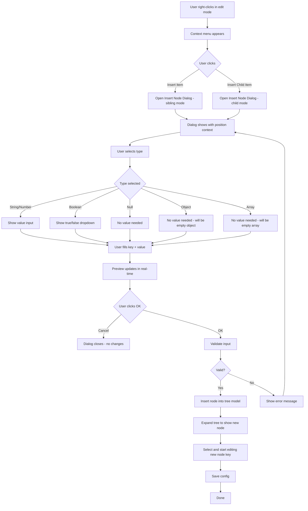
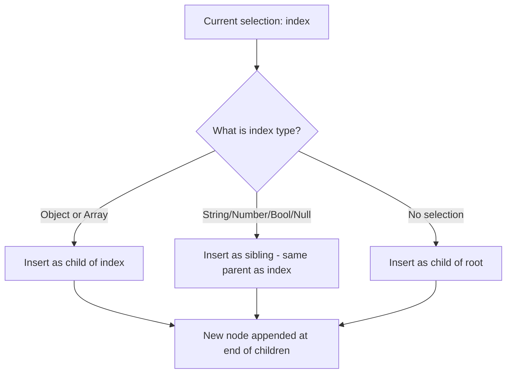
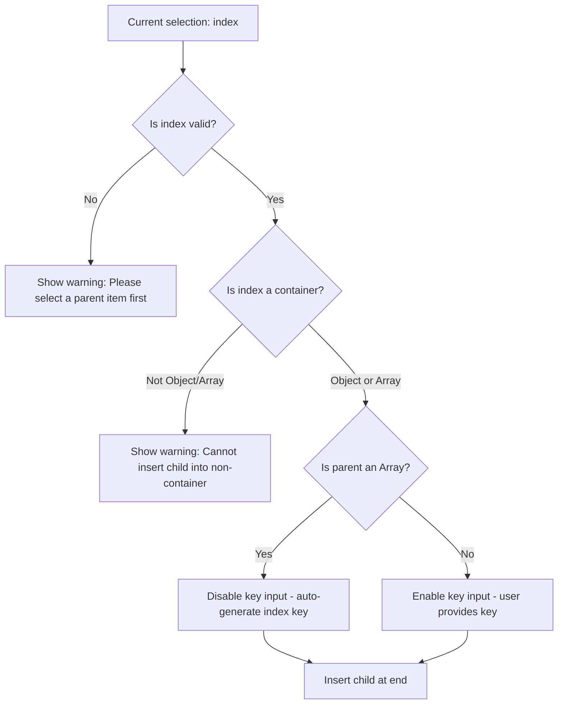

# Insert Node Dialog Design Plan

## Overview

Design a dialog for the JSON tree editor that allows users to insert different types of JSON nodes: **Object**, **Array**, and **Key-Value Pair** (with subtypes: String, Number, Boolean, Null).

---

## 1. Dialog UI Layout

```
┌─────────────────────────────────────────────┐
│  Insert Node                            [×]  │
├─────────────────────────────────────────────┤
│                                               │
│  Key:   [ ________________ ]                  │
│                                               │
│  Type:  ┌──────────────────────────────┐      │
│         │ ○ Key-Value Pair (String)    │      │
│         │ ○ Key-Value Pair (Number)    │      │
│         │ ○ Key-Value Pair (Boolean)   │      │
│         │ ○ Key-Value Pair (Null)      │      │
│         │ ○ JSON Object    {}          │      │
│         │ ○ JSON Array     []          │      │
│         └──────────────────────────────┘      │
│                                               │
│  Value: [ ________________ ]  ← only for KV  │
│                                               │
│  ┌─────────────────────────────────────────┐  │
│  │ Preview:                                │  │
│  │ "new_key": "new_value"                  │  │
│  └─────────────────────────────────────────┘  │
│                                               │
│         [ Cancel ]        [ OK ]              │
└─────────────────────────────────────────────┘
```

### UI Components

| Component | Type | Description |
|-----------|------|-------------|
| Key Input | QLineEdit | Node key name. Disabled when inserting into Array parent |
| Type Selection | QRadioButton group | 6 options: String, Number, Boolean, Null, Object, Array |
| Value Input | QLineEdit | Node value. Only visible when Key-Value type is selected |
| Boolean Combo | QComboBox | true/false selector. Only visible when Boolean type is selected |
| Preview Panel | QLabel | Real-time preview of the JSON fragment to be inserted |
| OK/Cancel | QPushButton | Confirm or cancel the insertion |

### Dynamic Visibility Rules

- **Key Input**: Disabled when parent is an Array (keys are auto-generated indices)
- **Value Input**: Only shown for String and Number types
- **Boolean Combo**: Only shown for Boolean type (dropdown with true/false)
- **Null**: No value input needed
- **Object/Array**: No value input needed (containers have no direct value)

---

## 2. Interaction Flow



---

## 3. Position Determination Rules

### Insert Item (Sibling)



### Insert Child Item



### Summary Table

| Scenario | Parent Type | Key Behavior | Position |
|----------|------------|--------------|----------|
| Insert Item, no selection | Root | User enters key | Appended to root |
| Insert Item, leaf selected | Parent of leaf | User enters key | Sibling after leaf |
| Insert Item, container selected | The container | User enters key | Child of container |
| Insert Child, array parent | Array | Auto-generated index | Appended to array |
| Insert Child, object parent | Object | User enters key | Appended to object |
| Insert Child, leaf selected | N/A | Show error | Operation rejected |

---

## 4. QJsonModel Changes Required

The current [`QJsonModel::insertItem()`](third_part/QJsonModel/QJsonModel.cpp:396) hardcodes `QJsonValue::String` type. It needs to accept a type parameter:

```cpp
// New signature
bool insertItem(const QModelIndex &parent, const QString &key, 
                const QVariant &value, QJsonValue::Type type = QJsonValue::String);
```

### Type-specific handling:

| Type | Key | Value | Children |
|------|-----|-------|----------|
| String | User input | User input string | None |
| Number | User input | Parsed as double | None |
| Boolean | User input | true/false | None |
| Null | User input | QJsonValue::Null | None |
| Object | User input | Empty string | Can have children added later |
| Array | Auto-index or user input | Empty string | Can have children added later |

---

## 5. File Changes Summary

### New Files
- `src/widgets/insertnodedialog.h` - Dialog header
- `src/widgets/insertnodedialog.cpp` - Dialog implementation  
- `src/widgets/insertnodedialog.ui` - Dialog UI layout

### Modified Files
- `third_part/QJsonModel/include/QJsonModel.hpp` - Add type parameter to `insertItem()`
- `third_part/QJsonModel/QJsonModel.cpp` - Implement type-aware `insertItem()`
- `src/widgets/jsonfmtwg.cpp` - Replace direct insert with dialog-based insert
- `translations/media-analyzer_zh_CN.ts` - Chinese translations
- `translations/media-analyzer_en_US.ts` - English translations
- `CMakeLists.txt` or `media-analyzer.pro` - Add new source files

---

## 6. Dialog Default Values

| Field | Default | Notes |
|-------|---------|-------|
| Key | `new_key` | For Object parent; disabled for Array parent |
| Type | String | First radio option selected by default |
| Value | `new_value` | For String type |
| Number Value | `0` | For Number type |
| Boolean Value | `true` | For Boolean type |

---

## 7. Validation Rules

1. **Key must not be empty** when parent is Object type
2. **Key must not duplicate** existing sibling keys in the same Object parent
3. **Number value** must be a valid number (double)
4. **Key** should be a valid JSON identifier (no special characters that break JSON structure)
5. When parent is Array, key is auto-generated and validation is skipped
